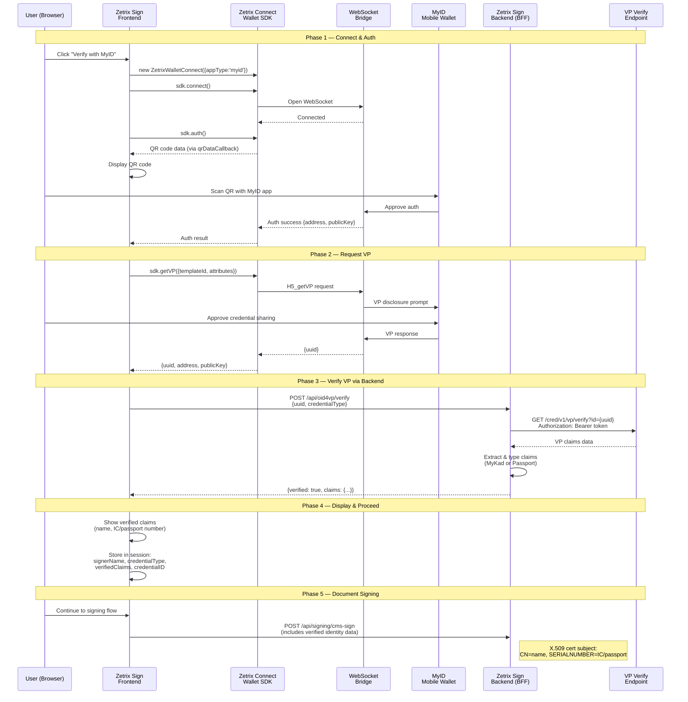

# OID4VP Verification Flow — Zetrix Sign

## Approach: SDK Direct (zetrix-connect-wallet-sdk `getVP`)

The frontend uses the SDK to connect to MyID wallet via WebSocket, requests a
Verifiable Presentation directly, and sends the resulting UUID to the backend
for verification against an external endpoint.

## Sequence Diagram



## Component Responsibilities

```
┌─────────────────────────────────────────────────────────┐
│                    ZETRIX SIGN APP                       │
│                                                         │
│  ┌──────────────────┐    ┌───────────────────────────┐  │
│  │    Frontend       │    │    Backend (BFF)           │  │
│  │                   │    │                           │  │
│  │  • SDK connect    │    │  • POST /api/oid4vp/verify│  │
│  │  • SDK auth (QR)  │    │    → call external verify │  │
│  │  • SDK getVP      │◄──►│    → extract claims       │  │
│  │  • Display claims │    │    → return to frontend   │  │
│  │  • Store session  │    │  • CMS signing w/ claims  │  │
│  └──────────────────┘    └───────────┬───────────────┘  │
│         │                            │                  │
│         ▼                            ▼                  │
│  ┌──────────────────┐    ┌───────────────────────────┐  │
│  │  WebSocket Bridge │    │  Zetrix API               │  │
│  │  (wss://wscw...)  │    │  GET /cred/v1/vp/verify   │  │
│  └────────┬─────────┘    └───────────────────────────┘  │
│           │                                             │
└───────────┼─────────────────────────────────────────────┘
            │
┌───────────▼─────────────┐
│   MyID Mobile Wallet     │
│                         │
│  • Store MyKad/Passport  │
│    Verifiable Credential │
│  • Scan QR / deep link  │
│  • Approve VP disclosure│
│  • Return VP via WS     │
└─────────────────────────┘
```

## Key Points

- **SDK handles the wallet interaction** — `getVP()` connects to MyID via WebSocket, shows QR, and retrieves the VP UUID directly
- **Backend verifies the VP** — takes the UUID, calls `GET /cred/v1/vp/verify?id={uuid}` on the Zetrix API with a Bearer token, returns typed claims
- **No callback/webhook needed** — this is a synchronous request-response flow (SDK → UUID → GET verify → claims)
- **`appType: 'myid'`** — the SDK must be initialized with MyID app type to connect to the MyID wallet
- **Template IDs** — each credential type (MyKad, Passport) has a unique template ID configured via env vars
- **Verified claims feed into CMS signing** — real identity (name, IC/passport number) embedded in the X.509 certificate subject

## Environment Variables

| Variable | Side | Dev/Test | Production |
|----------|------|----------|------------|
| `OID4VP_VERIFY_URL` | Server | `https://api-sandbox.zetrix.com/cred/v1/vp/verify` | `https://api-v2.zetrix.com/cred/v1/vp/verify` |
| `OID4VP_VERIFY_TOKEN` | Server | Test bearer token | Production bearer token |
| `NEXT_PUBLIC_MYKAD_TEMPLATE_ID` | Client | `did:zid:<test-hash>` | `did:zid:<prod-hash>` |
| `NEXT_PUBLIC_PASSPORT_TEMPLATE_ID` | Client | `did:zid:<test-hash>` | `did:zid:<prod-hash>` |
| `NEXT_PUBLIC_MYID_ANDROID_URL` | Client | Same | Same |
| `NEXT_PUBLIC_MYID_IOS_URL` | Client | Same | Same |

## Future Consideration: Token Consolidation

`MICROSERVICE_AUTH_TOKEN` and `OID4VP_VERIFY_TOKEN` are currently separate env
vars, both authenticating against the Zetrix API (`api-sandbox` in dev,
`api-v2` in production). If confirmed that a single token works for both the
microservice endpoints and the VP verify endpoint, these can be merged into a
single `ZETRIX_API_TOKEN` env var. This would require updating:
- `src/app/api/oid4vp/verify/route.ts` — read from shared token var
- Any other routes using `MICROSERVICE_AUTH_TOKEN`
- `.env.example`, `.env.local`, `.env.production.example`
