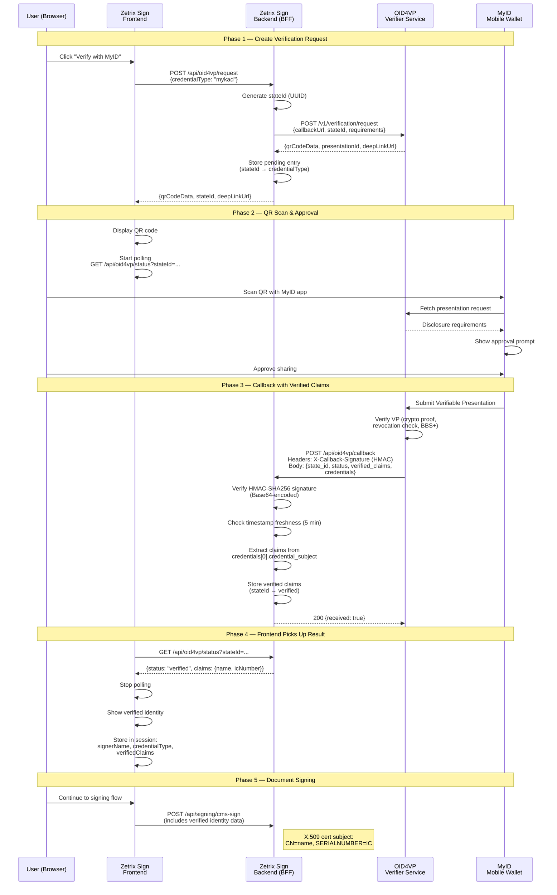

# OID4VP Verification Flow — Zetrix Sign

## Approach: Hosted Verifier (OID4VP API + Callback)

The backend calls the OID4VP hosted verifier API to create a verification
request, which returns a QR code. The user scans with MyID wallet and approves
credential sharing. The OID4VP service then POSTs an HMAC-signed callback to
the backend with the verified claims. The frontend polls for the result.

**Reference:** https://docs.zetrix.com/oid4vp

## Sequence Diagram



## Component Responsibilities

```
┌────────────────────────────────────────────────────────────────┐
│                      ZETRIX SIGN APP                           │
│                                                                │
│  ┌──────────────────────┐    ┌──────────────────────────────┐  │
│  │    Frontend           │    │    Backend (BFF)              │  │
│  │                       │    │                              │  │
│  │  • POST /api/oid4vp   │    │  POST /api/oid4vp/request    │  │
│  │    /request            │    │    → call OID4VP API          │  │
│  │  • Display QR code    │    │    → store pending entry     │  │
│  │  • Poll /api/oid4vp   │◄──►│    → return QR data          │  │
│  │    /status             │    │                              │  │
│  │  • Display claims     │    │  POST /api/oid4vp/callback   │  │
│  │  • Store session      │    │    → verify HMAC signature   │  │
│  │                       │    │    → extract claims from     │  │
│  │                       │    │      credentials array       │  │
│  │                       │    │    → store verified result   │  │
│  │                       │    │                              │  │
│  │                       │    │  GET /api/oid4vp/status      │  │
│  │                       │    │    → return pending/verified │  │
│  └──────────────────────┘    └──────────────┬───────────────┘  │
│                                             │                  │
└─────────────────────────────────────────────┼──────────────────┘
                                              │
┌─────────────────────────────────────────────┼──────────────────┐
│                                             │                  │
│  ┌──────────────────────────────────────────▼───────────────┐  │
│  │   OID4VP Hosted Verifier                                  │  │
│  │   https://zid-oid4vp-sandbox.zetrix.com/api               │  │
│  │                                                           │  │
│  │   • POST /v1/verification/request → creates QR            │  │
│  │   • Receives VP from wallet                               │  │
│  │   • Verifies crypto proofs (BBS+, BulletProofs)           │  │
│  │   • POSTs callback with HMAC-signed claims                │  │
│  └───────────────────────────────────────────────────────────┘  │
│                                                                │
│  ┌───────────────────────────────────────────────────────────┐  │
│  │   MyID Mobile Wallet                                      │  │
│  │                                                           │  │
│  │   • Stores MyKad / Passport VCs                           │  │
│  │   • Scans QR / opens deep link                            │  │
│  │   • Shows disclosure prompt → user approves               │  │
│  │   • Submits VP to verifier                                │  │
│  └───────────────────────────────────────────────────────────┘  │
│                                                                │
│                      EXTERNAL SERVICES                         │
└────────────────────────────────────────────────────────────────┘
```

## Callback Payload Structure

The OID4VP service sends a POST callback with **snake_case** field names:

```json
{
  "presentation_id": "pres_1775231459987_ca65d89f",
  "state_id": "1efda82d-f355-4d83-b9fc-c53f41e8c006",
  "status": "VERIFIED",
  "verified": true,
  "timestamp": 1775231465595,
  "credentials": [
    {
      "credential_subject": {
        "mykad": {
          "name": "IZAD IMRAN BIN MUHAMMAD BORHAN TAN",
          "icNo": "980621085921"
        }
      },
      "id": "did:zid:...",
      "issuer": "did:zid:...",
      "proof_types": ["BbsBlsSignatureProof2020"]
    }
  ],
  "verified_claims": {
    "mykad": {
      "$ref": "$.credentials[0].credential_subject.mykad"
    }
  }
}
```

**Key findings from real testing:**
- Field names are **snake_case** (e.g., `state_id`, `presentation_id`, `verified_claims`)
- The `verified_claims` field contains **JSON `$ref` pointers**, not actual data
- Actual claim data lives in `credentials[0].credential_subject.mykad` (or `.passport`)
- The callback code handles both snake_case and camelCase for resilience

## HMAC Signature Verification

Every callback includes an HMAC-SHA256 signature:

- **Header:** `X-Callback-Signature` — Base64-encoded HMAC
- **Header:** `X-Callback-Timestamp` — ISO-8601 timestamp
- **Algorithm:** `HMAC-SHA256(secret, "{timestamp}.{raw_json_body}")` → Base64
- **Freshness check:** Timestamp must be within 5 minutes (replay protection)
- **Comparison:** Constant-time comparison via `crypto.timingSafeEqual`

## Key Points

- **No SDK/WebSocket needed** — the hosted verifier handles all wallet interaction
- **Async callback flow** — backend creates request, OID4VP service calls back with result
- **HMAC security** — every callback is cryptographically signed and replay-protected
- **In-memory verification store** — bridges callback arrival to frontend polling (replace with Redis for multi-instance production)
- **Claims from credentials array** — `verified_claims` uses `$ref` pointers; actual data is in `credentials[0].credential_subject`
- **Deep link support** — `deepLinkUrl` enables same-device mobile flow (no QR scan needed)
- **Template IDs are server-side** — no longer exposed to the client via `NEXT_PUBLIC_` prefix

## Environment Variables

| Variable | Side | Dev/Test | Production |
|----------|------|----------|------------|
| `OID4VP_API_BASE` | Server | `https://zid-oid4vp-sandbox.zetrix.com/api` | `https://zid-oid4vp.zetrix.com/api` |
| `OID4VP_API_KEY` | Server | `ztx_<test-key>` | `ztx_<prod-key>` |
| `OID4VP_CALLBACK_SECRET` | Server | HMAC secret (from `/v1/client/callback-secret`) | Production secret |
| `OID4VP_CALLBACK_URL` | Server | ngrok tunnel URL | `https://your-domain.com/api/oid4vp/callback` |
| `MYKAD_TEMPLATE_ID` | Server | `did:zid:<test-hash>` | `did:zid:<prod-hash>` |
| `PASSPORT_TEMPLATE_ID` | Server | `did:zid:<test-hash>` | `did:zid:<prod-hash>` |
| `NEXT_PUBLIC_MYID_ANDROID_URL` | Client | Same | Same |
| `NEXT_PUBLIC_MYID_IOS_URL` | Client | Same | Same |

## File Map

| File | Purpose |
|------|---------|
| `src/app/api/oid4vp/request/route.ts` | Creates verification request with OID4VP API |
| `src/app/api/oid4vp/callback/route.ts` | Receives HMAC-signed callback, extracts claims |
| `src/app/api/oid4vp/status/route.ts` | Frontend polls for verification result |
| `src/lib/oid4vp/verification-store.ts` | In-memory store bridging callback → poll |
| `src/lib/oid4vp/claims.ts` | Helper functions for claim extraction |
| `src/types/oid4vp.ts` | All OID4VP type definitions |
| `src/components/signing/identity-verifier.tsx` | Frontend verification UI component |

## Migration History

- **v1 (SDK Direct):** Used `zetrix-connect-wallet-sdk` `getVP()` via WebSocket. Failed with "VC NOT AVAILABLE" because the template ID / wallet SDK had compatibility issues.
- **v2 (Hosted Verifier — current):** Uses the OID4VP hosted verifier API at `zid-oid4vp-sandbox.zetrix.com`. Backend creates request, gets QR, service sends callback. Successfully tested with real MyKad VC.
